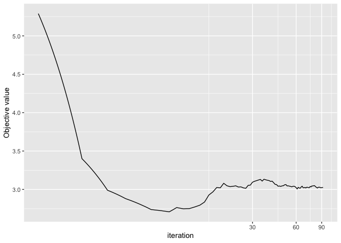
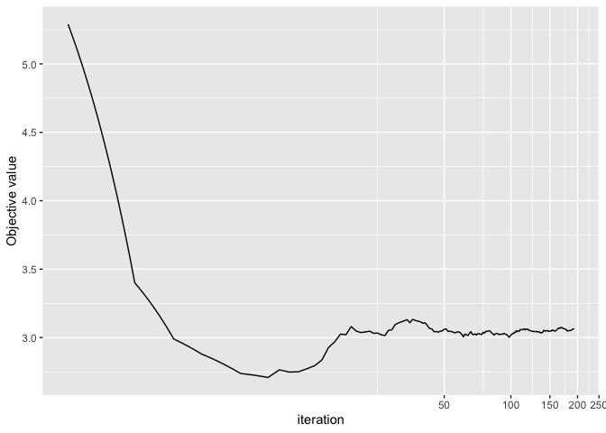

<!-- README.md is generated from README.Rmd. Please edit that file -->

# RRRR

<!-- badges: start -->

[](https://cran.r-project.org/package=RRRR)
[](https://cran.r-project.org/package=RRRR)
[](https://www.gnu.org/licenses/gpl-3.0.en.html)
[](https://github.com/FinYang/RRRR/actions/workflows/R-CMD-check.yaml)
<!-- badges: end -->

The R package *RRRR* provides methods for estimating online Robust
Reduced-Rank Regression.

To cite package ‘RRRR’ in publications use:

> Yangzhuoran Fin Yang and Ziping Zhao (2023). RRRR: Online Robust
> Reduced-Rank Regression Estimation. R package version 1.1.1.
> <https://pkg.yangzhuoranyang.com/RRRR/>.

## Installation

You can install the **stable** version on [R
CRAN](https://CRAN.R-project.org/package=RRRR).

``` r
install.packages("RRRR")
```

You can install the **development** version from
[Github](https://github.com/FinYang/RRRR) with:

``` r
# install.packages("devtools")
devtools::install_github("FinYang/RRRR")
```

## Usage

The R package *RRRR* provides the following estimation methods.

1.  Reduced-Rank Regression using Gaussian MLE: `RRR`
2.  Robust Reduced-Rank Regression using Cauchy distribution and
    Majorisation-Minimisation: `RRRR`
3.  Online Robust Reduced-Rank Regression: `ORRRR`
    - SMM: Stochastic Majorisation-Minimisation
    - SAA: Sample Average Approximation
4.  Online update of the above model (except `RRR`): `update.RRRR`

See the vignette for a more detailed illustration.

``` r
library(RRRR)
set.seed(2222)
data <- RRR_sim()
res <- ORRRR(y=data$y, x=data$x, z=data$z)
res
#> Online Robust Reduced-Rank Regression
#> ------
#> Stochastic Majorisation-Minimisation
#> ------------
#> Specifications:
#>            N            P            R            r initial_size        addon 
#>         1000            3            1            1          100           10 
#> 
#> Coefficients:
#>          mu         A         B         D    Sigma1    Sigma2    Sigma3
#> 1  0.078343 -0.167661  1.553252  0.204748  0.656940 -0.044872  0.050316
#> 2  0.139471  0.442293  0.919832  1.138335 -0.044872  0.657402 -0.063890
#> 3  0.106746  0.801818 -0.693768  1.955019  0.050316 -0.063890  0.698777
plot(res)
```

<!-- -->

``` r

newdata <- RRR_sim(A = data$spec$A,
                   B = data$spec$B,
                   D = data$spec$D)
res2 <- update(res, newy=newdata$y, newx=newdata$x, newz=newdata$z)
res2
#> Online Robust Reduced-Rank Regression
#> ------
#> Stochastic Majorisation-Minimisation
#> ------------
#> Specifications:
#>            N            P            R            r initial_size        addon 
#>         2000            3            1            1         1010           10 
#> 
#> Coefficients:
#>          mu         A         B         D    Sigma1    Sigma2    Sigma3
#> 1  0.073939 -0.159814  1.520309  0.208943  0.675436 -0.021789  0.040888
#> 2  0.142791  0.450992  0.962698  1.117024 -0.021789  0.679136 -0.024140
#> 3  0.107647  0.817590 -0.670435  1.957084  0.040888 -0.024140  0.703949
plot(res2)
```

<!-- -->

## License

This package is free and open source software, licensed under GPL-3.
